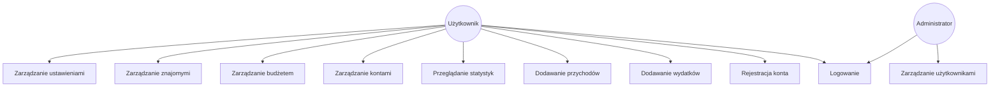
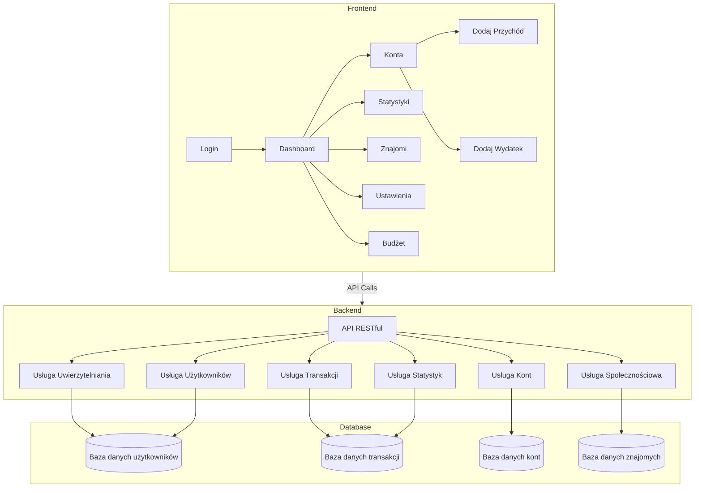
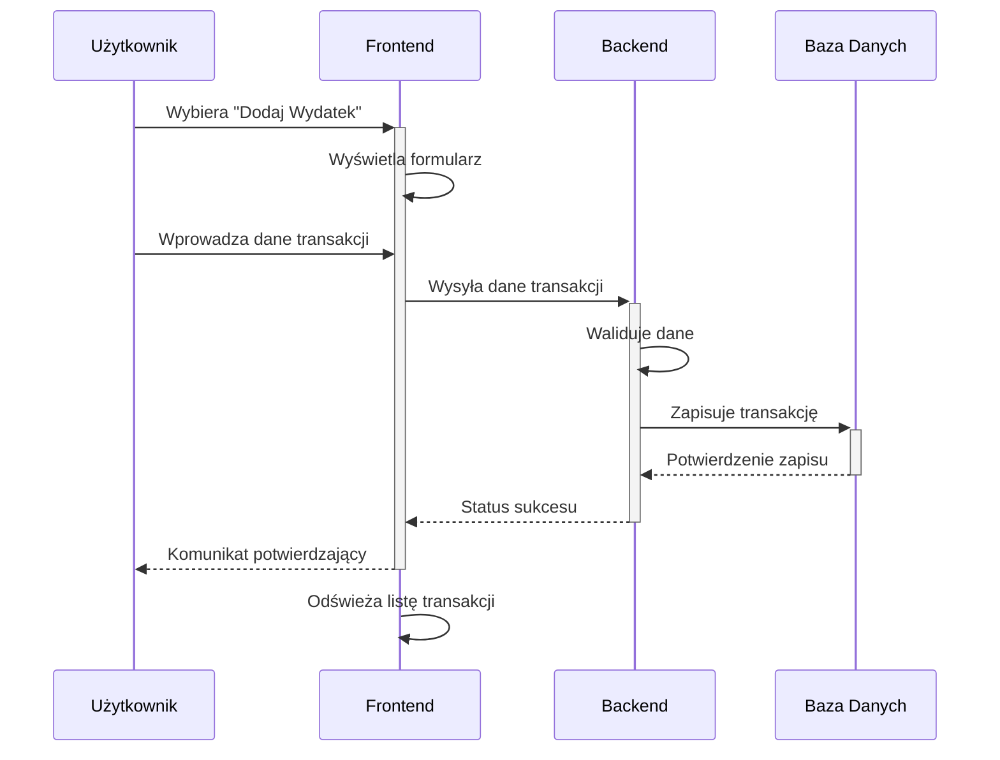
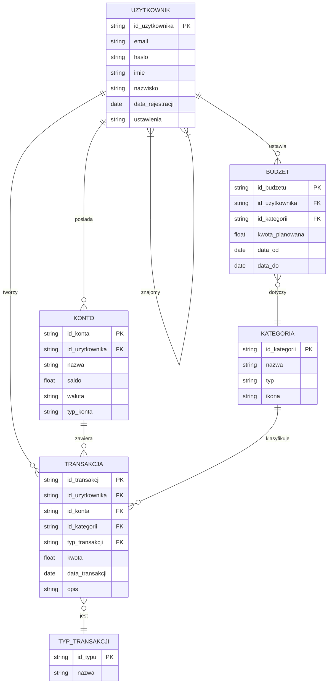
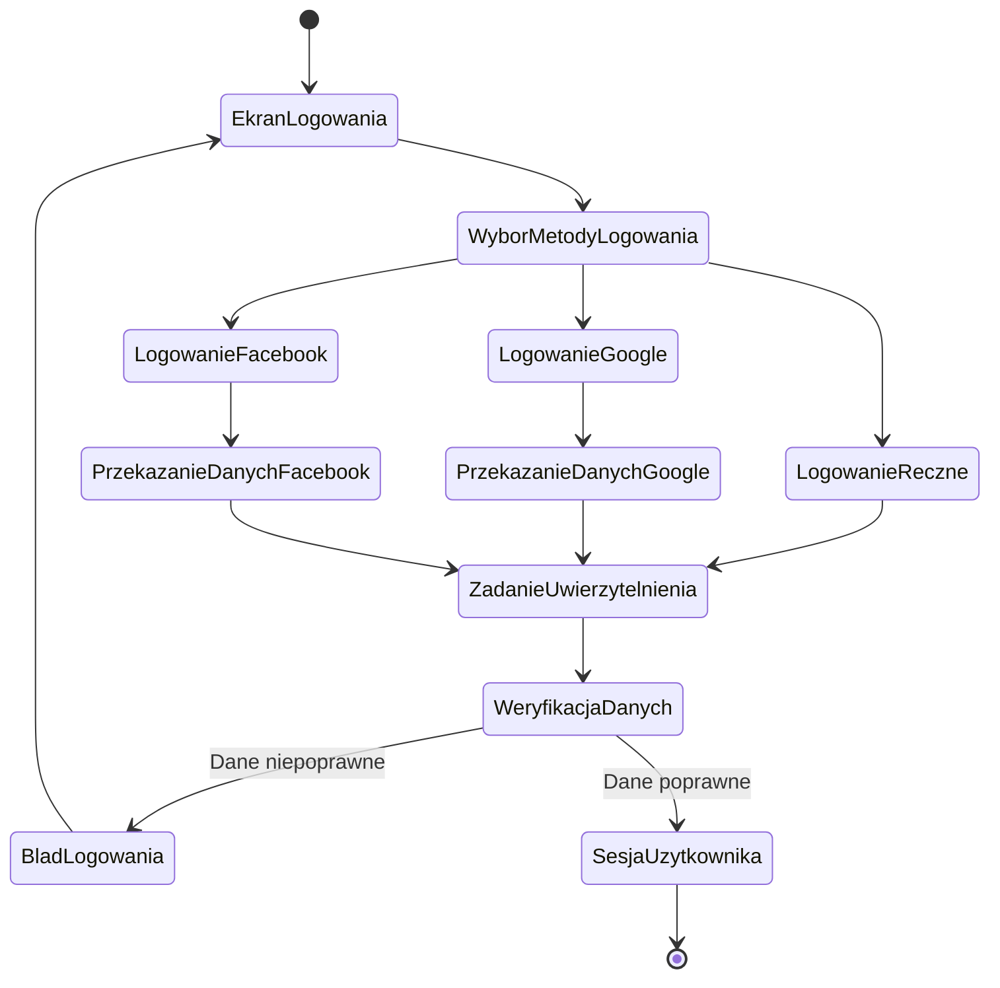
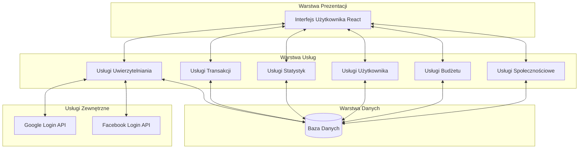

# Aplikacja do Śledzenia Finansów

Osobista aplikacja finansowa do śledzenia przychodów i wydatków.

## Struktura Projektu

- `frontend/`: Aplikacja React
- `backend/`: API backendowe (do zaimplementowania)

## Rozpoczęcie Pracy

### Uruchamianie z Dockerem

Aby uruchomić aplikację przy użyciu Dockera:

```bash
docker-compose up
```

### Lokalne Uruchamianie Frontendu

Aby uruchomić tylko aplikację frontendową:

1. Przejdź do katalogu frontend:
```bash
cd frontend
```

2. Zainstaluj zależności:
```bash
npm install
```

3. Uruchom serwer deweloperski:
```bash
npm start
```

4. Otwórz przeglądarkę i przejdź do http://localhost:3000

## Funkcjonalności

- Logowanie społecznościowe przez Google i Facebook
- Śledzenie przychodów i wydatków
- Przeglądanie raportów finansowych i analityki

## Diagramy

### Diagram Przypadków Użycia



### Diagram Komponentów



### Diagram Przepływu Procesu - Dodawanie Transakcji



### Diagram Encji (ERD)



### Diagram Stanów - Proces Logowania



### Diagram Architektury Systemu

