# Aplikacja do Śledzenia Finansów

Osobista aplikacja finansowa do śledzenia przychodów i wydatków.

## Struktura Projektu

- `frontend/`: Aplikacja React
- `backend/`: API backendowe (do zaimplementowania)

## Rozpoczęcie Pracy

### Uruchamianie z Dockerem

Aby uruchomić aplikację przy użyciu Dockera:

```bash
docker-compose up
```

### Lokalne Uruchamianie Frontendu

Aby uruchomić tylko aplikację frontendową:

1. Przejdź do katalogu frontend:
```bash
cd frontend
```

2. Zainstaluj zależności:
```bash
npm install
```

3. Uruchom serwer deweloperski:
```bash
npm start
```

4. Otwórz przeglądarkę i przejdź do http://localhost:3000

## Funkcjonalności

- Logowanie przez Google i Facebook
- Śledzenie przychodów i wydatków
- Przeglądanie raportów finansowych i analityki

## Diagramy Przepływów Procesów

### Proces: Tworzenie Budżetów

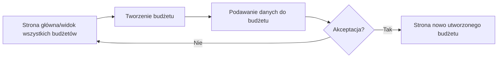

### Proces: Dodawanie Wydatków

```mermaid
flowchart LR
    A[Strona główna/Dashboard] --> B[Przejście do sekcji Konta]
    B --> C[Wybór opcji "Dodaj Wydatek"]
    C --> D[Wypełnienie formularza wydatku]
    D --> E{Zatwierdzenie?}
    E -->|Tak| F[Zapisanie wydatku]
    F --> G[Aktualizacja salda konta]
    G --> H[Powrót do listy transakcji]
    E -->|Nie| B
```

### Proces: Dodawanie Przychodów

```mermaid
flowchart LR
    A[Strona główna/Dashboard] --> B[Przejście do sekcji Konta]
    B --> C[Wybór opcji "Dodaj Przychód"]
    C --> D[Wypełnienie formularza przychodu]
    D --> E{Zatwierdzenie?}
    E -->|Tak| F[Zapisanie przychodu]
    F --> G[Aktualizacja salda konta]
    G --> H[Powrót do listy transakcji]
    E -->|Nie| B
```

### Proces: Rejestracja Użytkownika

```mermaid
flowchart LR
    A[Strona logowania] --> B[Wybór opcji "Zarejestruj się"]
    B --> C[Wypełnienie formularza rejestracji]
    C --> D{Walidacja danych}
    D -->|Niepoprawne| C
    D -->|Poprawne| E[Utworzenie konta]
    E --> F[Wysłanie emaila z potwierdzeniem]
    F --> G[Strona logowania z komunikatem sukcesu]
```

### Proces: Zarządzanie Profilem Użytkownika

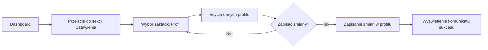

### Proces: Przeglądanie Statystyk

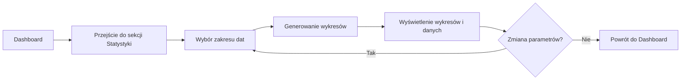

### Proces: Zarządzanie Kontami

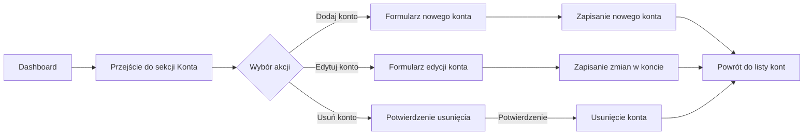

### Proces: Zarządzanie Znajomymi

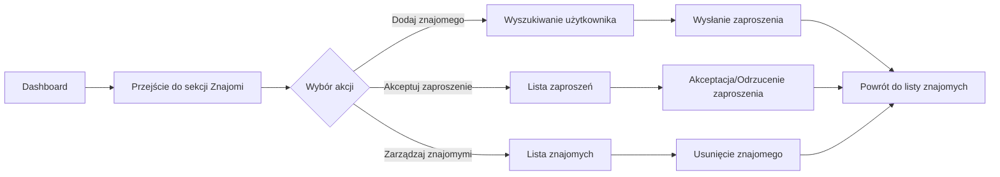

## Diagramy

### Diagram Przypadków Użycia

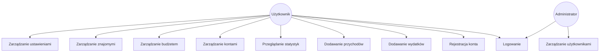

### Diagram Komponentów

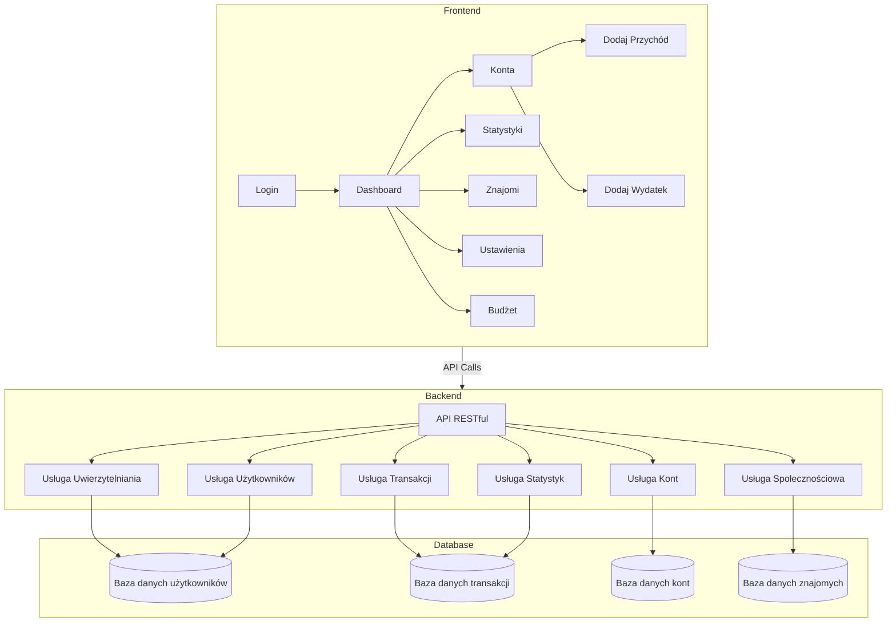

### Diagram Przepływu Procesu - Dodawanie Transakcji

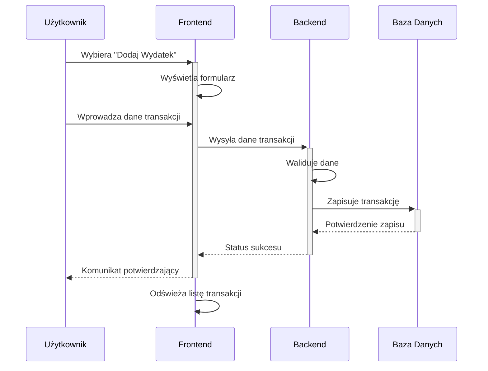

### Diagram Encji (ERD)

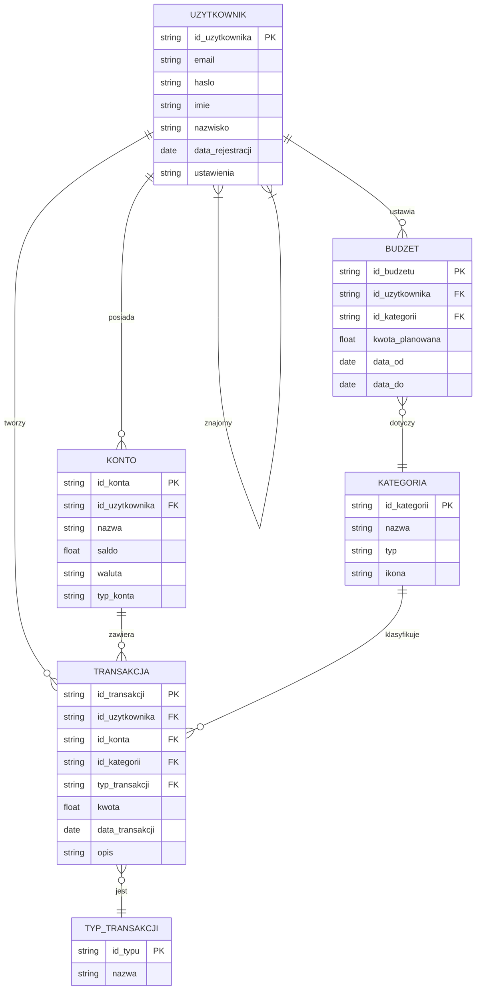

### Diagram Stanów - Proces Logowania

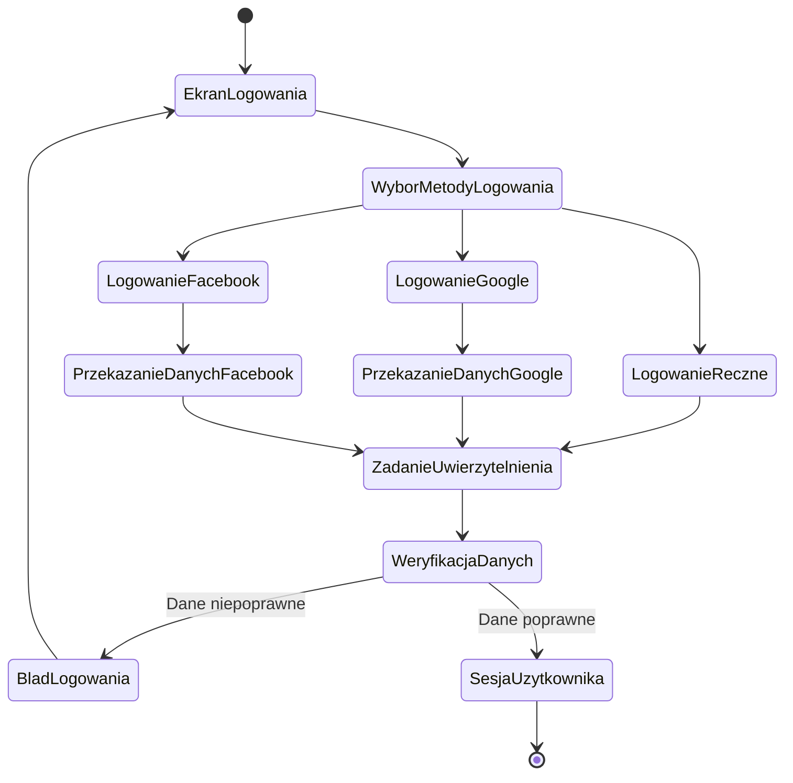

### Diagram Architektury Systemu

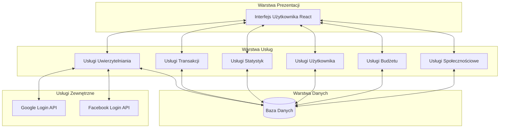
