# Diagramy MyMoney

## Spis treści

1. [Przypadki użycia](#przypadki-użycia)
2. [Flow charty](#flow-charty)
3. [Diagramy sekwencji](#diagramy-sekwencji)
4. [Diagramy stanów](#diagramy-stanów)
5. [Diagramy klas](#diagramy-klas)
6. [Diagramy komponentów](#diagramy-komponentów)
7. [Diagramy wdrożenia](#diagramy-wdrożenia)
8. [Diagramy przepływu danych](#diagramy-przepływu-danych)

## Przypadki użycia

### Główne przypadki użycia systemu

```mermaid
graph TB
    User[👤 Użytkownik]
    Admin[👨‍💼 Administrator]
    Guest[👥 Gość]
    
    subgraph "System MyMoney"
        UC1[Rejestracja konta]
        UC2[Logowanie]
        UC3[Zarządzanie profilem]
        UC4[Tworzenie kont finansowych]
        UC5[Dodawanie transakcji]
        UC6[Kategoryzowanie wydatków]
        UC7[Przeglądanie statystyk]
        UC8[Tworzenie budżetów]
        UC9[Udostępnianie kont]
        UC10[Eksport danych]
        UC11[Zarządzanie użytkownikami]
        UC12[Monitorowanie systemu]
    end
    
    Guest --> UC1
    Guest --> UC2
    
    User --> UC2
    User --> UC3
    User --> UC4
    User --> UC5
    User --> UC6
    User --> UC7
    User --> UC8
    User --> UC9
    User --> UC10
    
    Admin --> UC11
    Admin --> UC12
    Admin --> UC7
```

### Szczegółowe przypadki użycia - Zarządzanie transakcjami

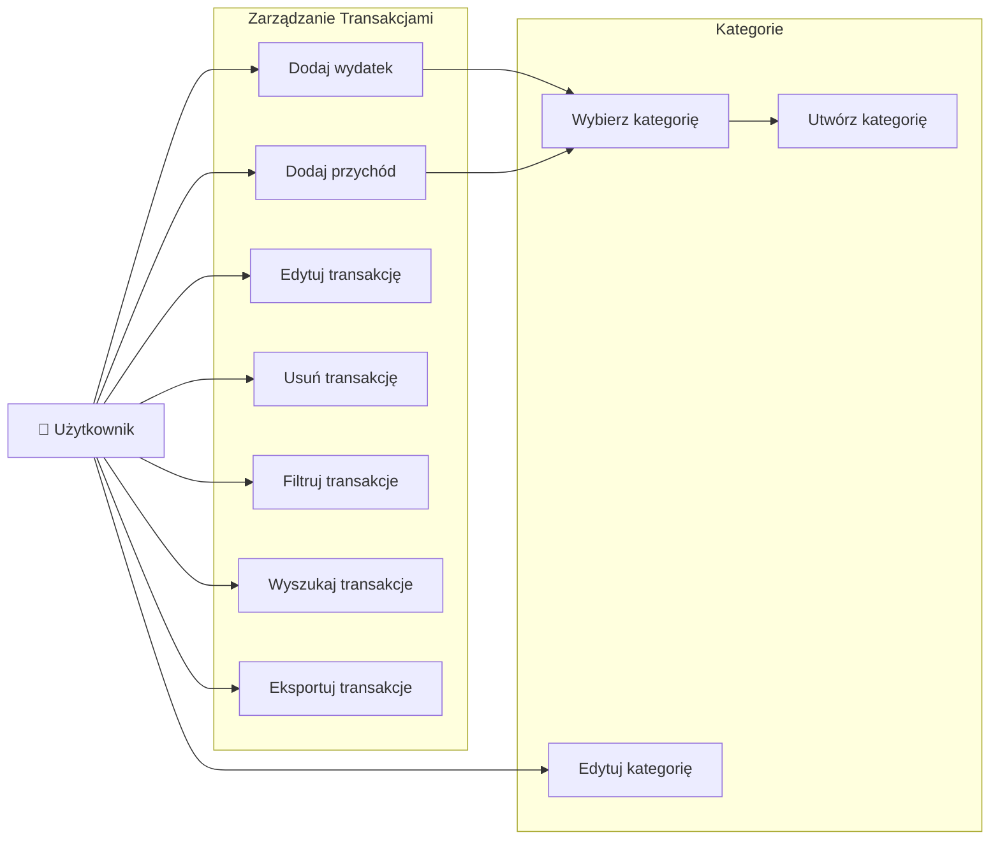
```mermaid
graph LR
    User[👤 Użytkownik]
    
    subgraph "Zarządzanie Transakcjami"
        UC1[Dodaj wydatek]
        UC2[Dodaj przychód]
        UC3[Edytuj transakcję]
        UC4[Usuń transakcję]
        UC5[Filtruj transakcje]
        UC6[Wyszukaj transakcje]
        UC7[Eksportuj transakcje]
    end
    
    subgraph "Kategorie"
        UC8[Wybierz kategorię]
        UC9[Utwórz kategorię]
        UC10[Edytuj kategorię]
    end
    
    User --> UC1
    User --> UC2
    User --> UC3
    User --> UC4
    User --> UC5
    User --> UC6
    User --> UC7
    
    UC1 --> UC8
    UC2 --> UC8
    UC8 --> UC9
    User --> UC10
```

## Flow charty

### Proces rejestracji użytkownika

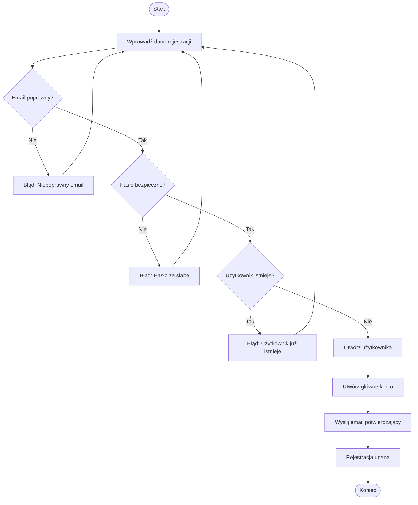
```mermaid
flowchart TD
    Start([Start]) --> Input[Wprowadź dane rejestracji]
    Input --> ValidateEmail{Email poprawny?}
    ValidateEmail -->|Nie| ErrorEmail[Błąd: Niepoprawny email]
    ErrorEmail --> Input
    
    ValidateEmail -->|Tak| ValidatePassword{Hasło bezpieczne?}
    ValidatePassword -->|Nie| ErrorPassword[Błąd: Hasło za słabe]
    ErrorPassword --> Input
    
    ValidatePassword -->|Tak| CheckExists{Użytkownik istnieje?}
    CheckExists -->|Tak| ErrorExists[Błąd: Użytkownik już istnieje]
    ErrorExists --> Input
    
    CheckExists -->|Nie| CreateUser[Utwórz użytkownika]
    CreateUser --> CreateMainWallet[Utwórz główne konto]
    CreateMainWallet --> SendConfirmation[Wyślij email potwierdzający]
    SendConfirmation --> Success[Rejestracja udana]
    Success --> End([Koniec])
```

### Proces dodawania transakcji

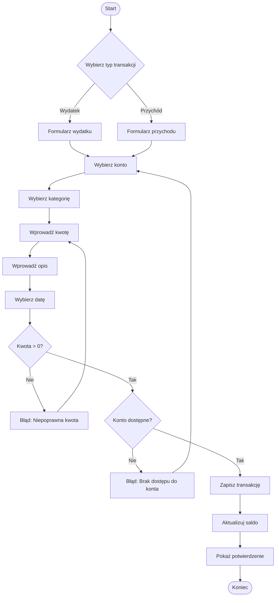
```mermaid
flowchart TD
    Start([Start]) --> SelectType{Wybierz typ transakcji}
    SelectType -->|Wydatek| ExpenseForm[Formularz wydatku]
    SelectType -->|Przychód| IncomeForm[Formularz przychodu]
    
    ExpenseForm --> SelectWallet[Wybierz konto]
    IncomeForm --> SelectWallet
    
    SelectWallet --> SelectCategory[Wybierz kategorię]
    SelectCategory --> EnterAmount[Wprowadź kwotę]
    EnterAmount --> EnterDescription[Wprowadź opis]
    EnterDescription --> SelectDate[Wybierz datę]
    
    SelectDate --> ValidateAmount{Kwota > 0?}
    ValidateAmount -->|Nie| ErrorAmount[Błąd: Niepoprawna kwota]
    ErrorAmount --> EnterAmount
    
    ValidateAmount -->|Tak| ValidateWallet{Konto dostępne?}
    ValidateWallet -->|Nie| ErrorWallet[Błąd: Brak dostępu do konta]
    ErrorWallet --> SelectWallet
    
    ValidateWallet -->|Tak| SaveTransaction[Zapisz transakcję]
    SaveTransaction --> UpdateBalance[Aktualizuj saldo]
    UpdateBalance --> ShowSuccess[Pokaż potwierdzenie]
    ShowSuccess --> End([Koniec])
```

### Proces logowania

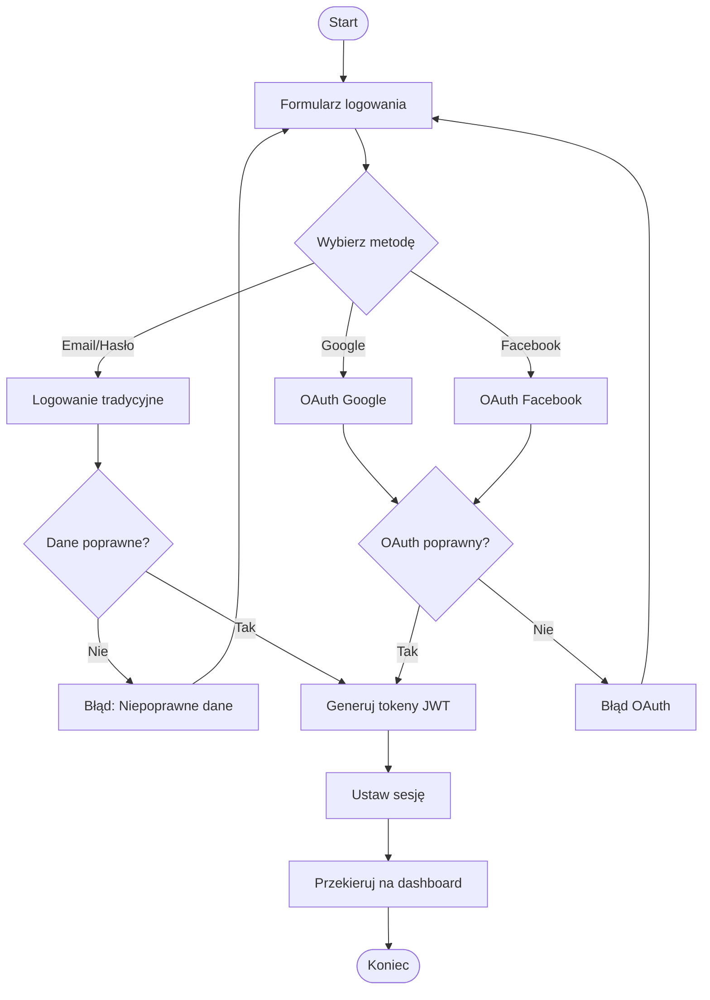
```mermaid
flowchart TD
    Start([Start]) --> LoginForm[Formularz logowania]
    LoginForm --> ChooseMethod{Wybierz metodę}
    
    ChooseMethod -->|Email/Hasło| EmailLogin[Logowanie tradycyjne]
    ChooseMethod -->|Google| GoogleOAuth[OAuth Google]
    ChooseMethod -->|Facebook| FacebookOAuth[OAuth Facebook]
    
    EmailLogin --> ValidateCredentials{Dane poprawne?}
    ValidateCredentials -->|Nie| ErrorCredentials[Błąd: Niepoprawne dane]
    ErrorCredentials --> LoginForm
    
    ValidateCredentials -->|Tak| GenerateTokens[Generuj tokeny JWT]
    GoogleOAuth --> ValidateOAuth{OAuth poprawny?}
    FacebookOAuth --> ValidateOAuth
    
    ValidateOAuth -->|Nie| ErrorOAuth[Błąd OAuth]
    ErrorOAuth --> LoginForm
    ValidateOAuth -->|Tak| GenerateTokens
    
    GenerateTokens --> SetSession[Ustaw sesję]
    SetSession --> RedirectDashboard[Przekieruj na dashboard]
    RedirectDashboard --> End([Koniec])
```

## Diagramy sekwencji

### Sekwencja dodawania transakcji

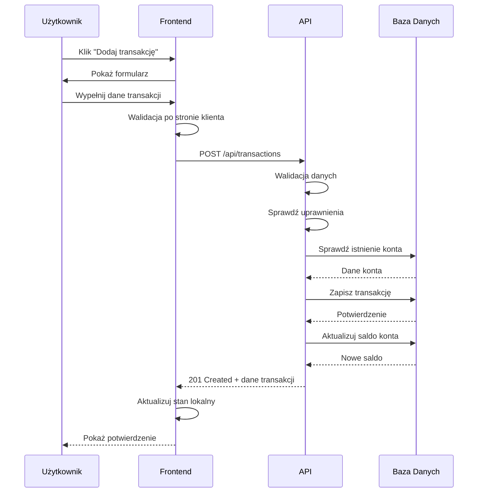
```mermaid
sequenceDiagram
    participant U as Użytkownik
    participant F as Frontend
    participant A as API
    participant DB as Baza Danych
    
    U->>F: Klik "Dodaj transakcję"
    F->>U: Pokaż formularz
    U->>F: Wypełnij dane transakcji
    F->>F: Walidacja po stronie klienta
    F->>A: POST /api/transactions
    
    A->>A: Walidacja danych
    A->>A: Sprawdź uprawnienia
    A->>DB: Sprawdź istnienie konta
    DB-->>A: Dane konta
    
    A->>DB: Zapisz transakcję
    DB-->>A: Potwierdzenie
    A->>DB: Aktualizuj saldo konta
    DB-->>A: Nowe saldo
    
    A-->>F: 201 Created + dane transakcji
    F->>F: Aktualizuj stan lokalny
    F-->>U: Pokaż potwierdzenie
```

### Sekwencja uwierzytelniania JWT

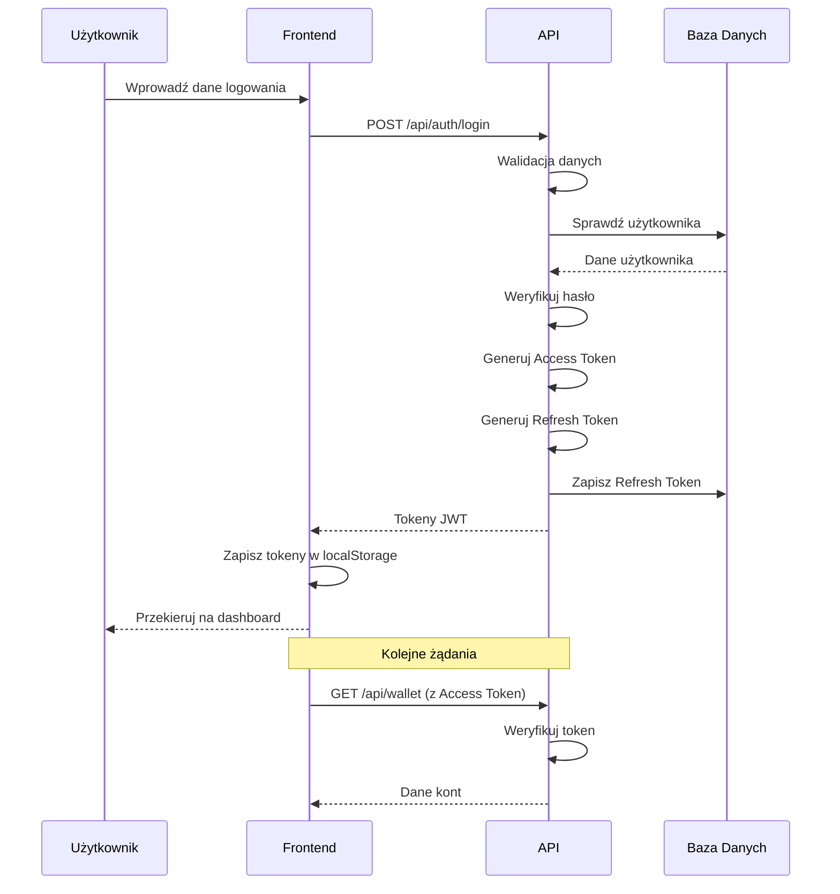
```mermaid
sequenceDiagram
    participant U as Użytkownik
    participant F as Frontend
    participant A as API
    participant DB as Baza Danych
    
    U->>F: Wprowadź dane logowania
    F->>A: POST /api/auth/login
    A->>A: Walidacja danych
    A->>DB: Sprawdź użytkownika
    DB-->>A: Dane użytkownika
    
    A->>A: Weryfikuj hasło
    A->>A: Generuj Access Token
    A->>A: Generuj Refresh Token
    A->>DB: Zapisz Refresh Token
    
    A-->>F: Tokeny JWT
    F->>F: Zapisz tokeny w localStorage
    F-->>U: Przekieruj na dashboard
    
    Note over F,A: Kolejne żądania
    F->>A: GET /api/wallet (z Access Token)
    A->>A: Weryfikuj token
    A-->>F: Dane kont
```

### Sekwencja odświeżania tokenu

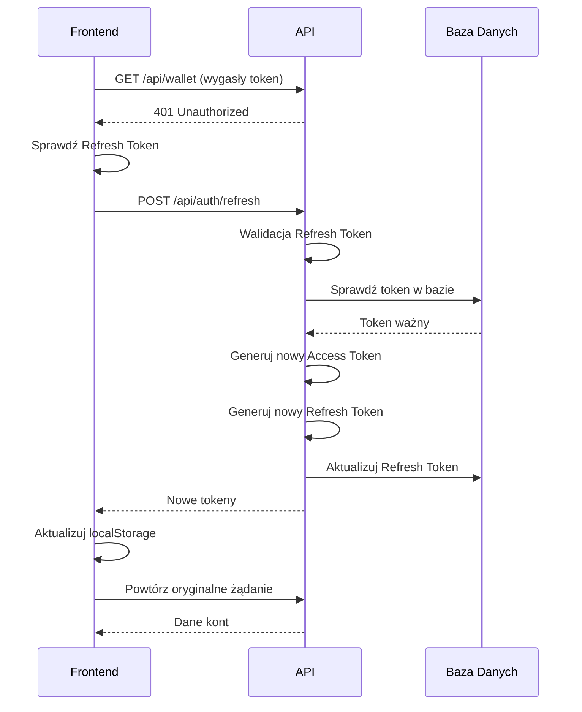
```mermaid
sequenceDiagram
    participant F as Frontend
    participant A as API
    participant DB as Baza Danych
    
    F->>A: GET /api/wallet (wygasły token)
    A-->>F: 401 Unauthorized
    
    F->>F: Sprawdź Refresh Token
    F->>A: POST /api/auth/refresh
    A->>A: Walidacja Refresh Token
    A->>DB: Sprawdź token w bazie
    DB-->>A: Token ważny
    
    A->>A: Generuj nowy Access Token
    A->>A: Generuj nowy Refresh Token
    A->>DB: Aktualizuj Refresh Token
    
    A-->>F: Nowe tokeny
    F->>F: Aktualizuj localStorage
    F->>A: Powtórz oryginalne żądanie
    A-->>F: Dane kont
```

## Diagramy stanów

### Stany transakcji

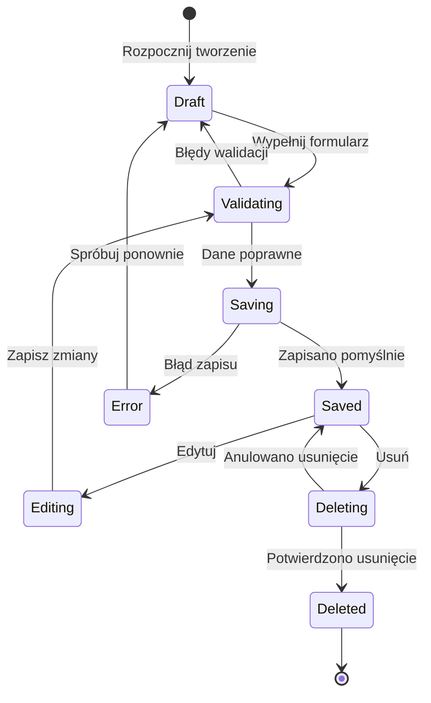
```mermaid
stateDiagram-v2
    [*] --> Draft: Rozpocznij tworzenie
    Draft --> Validating: Wypełnij formularz
    Validating --> Draft: Błędy walidacji
    Validating --> Saving: Dane poprawne
    Saving --> Saved: Zapisano pomyślnie
    Saving --> Error: Błąd zapisu
    Error --> Draft: Spróbuj ponownie
    Saved --> Editing: Edytuj
    Editing --> Validating: Zapisz zmiany
    Saved --> Deleting: Usuń
    Deleting --> Deleted: Potwierdzono usunięcie
    Deleting --> Saved: Anulowano usunięcie
    Deleted --> [*]
```

### Stany sesji użytkownika

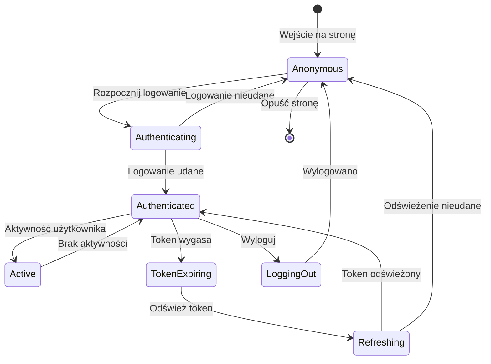
```mermaid
stateDiagram-v2
    [*] --> Anonymous: Wejście na stronę
    Anonymous --> Authenticating: Rozpocznij logowanie
    Authenticating --> Authenticated: Logowanie udane
    Authenticating --> Anonymous: Logowanie nieudane
    
    Authenticated --> Active: Aktywność użytkownika
    Active --> Authenticated: Brak aktywności
    Authenticated --> TokenExpiring: Token wygasa
    TokenExpiring --> Refreshing: Odśwież token
    Refreshing --> Authenticated: Token odświeżony
    Refreshing --> Anonymous: Odświeżenie nieudane
    
    Authenticated --> LoggingOut: Wyloguj
    LoggingOut --> Anonymous: Wylogowano
    Anonymous --> [*]: Opuść stronę
```

### Stany konta finansowego

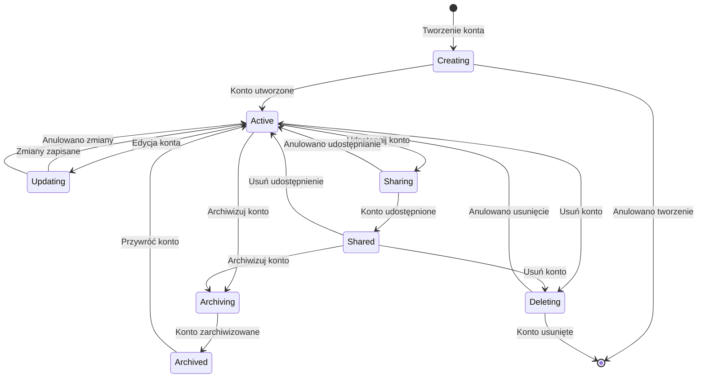
```mermaid
stateDiagram-v2
    [*] --> Creating: Tworzenie konta
    Creating --> Active: Konto utworzone
    Creating --> [*]: Anulowano tworzenie
    
    Active --> Updating: Edycja konta
    Updating --> Active: Zmiany zapisane
    Updating --> Active: Anulowano zmiany
    
    Active --> Sharing: Udostępnij konto
    Sharing --> Shared: Konto udostępnione
    Sharing --> Active: Anulowano udostępnianie
    
    Shared --> Active: Usuń udostępnienie
    Active --> Archiving: Archiwizuj konto
    Shared --> Archiving: Archiwizuj konto
    Archiving --> Archived: Konto zarchiwizowane
    Archived --> Active: Przywróć konto
    
    Active --> Deleting: Usuń konto
    Shared --> Deleting: Usuń konto
    Deleting --> [*]: Konto usunięte
    Deleting --> Active: Anulowano usunięcie
```

## Diagramy klas

### Model domenowy - Główne klasy

```mermaid
classDiagram
    class User {
        +Guid Id
        +string Email
        +string HashedPassword
        +string RefreshToken
        +DateTime RefreshTokenExpiration
        +Guid MainWalletId
        +DateTime CreatedAt
        +ValidatePassword(password) bool
        +GenerateRefreshToken() string
    }
    
    class Wallet {
        +Guid Id
        +string Name
        +WalletType Type
        +decimal InitialBalance
        +string Currency
        +Guid CreatedByUserId
        +DateTime CreatedAt
        +CalculateCurrentBalance() decimal
        +AddMember(userId, role) void
        +RemoveMember(userId) void
    }
    
    class Transaction {
        +Guid Id
        +Guid WalletId
        +Guid CategoryId
        +decimal Amount
        +string Description
        +DateTime Date
        +TransactionType Type
        +DateTime CreatedAt
        +DateTime UpdatedAt
        +IsExpense() bool
        +IsIncome() bool
    }
    
    class Category {
        +Guid Id
        +string Name
        +CategoryType Type
        +string Icon
        +bool IsDefault
        +Guid CreatedByUserId
        +DateTime CreatedAt
    }
    
    class WalletMember {
        +Guid WalletId
        +Guid UserId
        +MemberRole Role
        +DateTime JoinedAt
        +HasPermission(action) bool
    }
    
    User ||--o{ Wallet : creates
    User ||--o{ WalletMember : participates
    Wallet ||--o{ Transaction : contains
    Wallet ||--o{ WalletMember : has
    Category ||--o{ Transaction : categorizes
    User ||--o{ Category : creates
```

### Kontrolery API

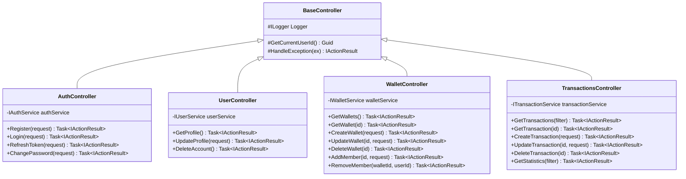
```mermaid
classDiagram
    class BaseController {
        #ILogger Logger
        #GetCurrentUserId() Guid
        #HandleException(ex) IActionResult
    }
    
    class AuthController {
        -IAuthService authService
        +Register(request) Task~IActionResult~
        +Login(request) Task~IActionResult~
        +RefreshToken(request) Task~IActionResult~
        +ChangePassword(request) Task~IActionResult~
    }
    
    class UserController {
        -IUserService userService
        +GetProfile() Task~IActionResult~
        +UpdateProfile(request) Task~IActionResult~
        +DeleteAccount() Task~IActionResult~
    }
    
    class WalletController {
        -IWalletService walletService
        +GetWallets() Task~IActionResult~
        +GetWallet(id) Task~IActionResult~
        +CreateWallet(request) Task~IActionResult~
        +UpdateWallet(id, request) Task~IActionResult~
        +DeleteWallet(id) Task~IActionResult~
        +AddMember(id, request) Task~IActionResult~
        +RemoveMember(walletId, userId) Task~IActionResult~
    }
    
    class TransactionsController {
        -ITransactionService transactionService
        +GetTransactions(filter) Task~IActionResult~
        +GetTransaction(id) Task~IActionResult~
        +CreateTransaction(request) Task~IActionResult~
        +UpdateTransaction(id, request) Task~IActionResult~
        +DeleteTransaction(id) Task~IActionResult~
        +GetStatistics(filter) Task~IActionResult~
    }
    
    BaseController <|-- AuthController
    BaseController <|-- UserController
    BaseController <|-- WalletController
    BaseController <|-- TransactionsController
```

## Diagramy komponentów

### Architektura frontendu

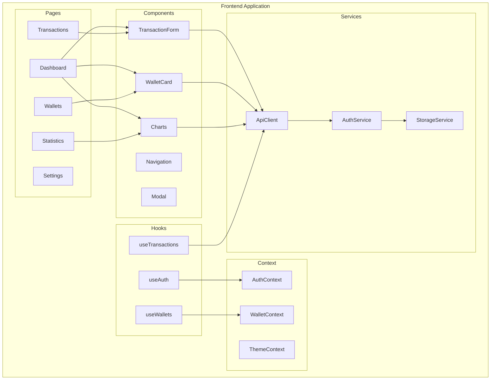
```mermaid
graph TB
    subgraph "Frontend Application"
        subgraph "Pages"
            Dashboard[Dashboard]
            Transactions[Transactions]
            Wallets[Wallets]
            Statistics[Statistics]
            Settings[Settings]
        end
        
        subgraph "Components"
            TransactionForm[TransactionForm]
            WalletCard[WalletCard]
            Charts[Charts]
            Navigation[Navigation]
            Modal[Modal]
        end
        
        subgraph "Services"
            ApiClient[ApiClient]
            AuthService[AuthService]
            StorageService[StorageService]
        end
        
        subgraph "Context"
            AuthContext[AuthContext]
            WalletContext[WalletContext]
            ThemeContext[ThemeContext]
        end
        
        subgraph "Hooks"
            useAuth[useAuth]
            useWallets[useWallets]
            useTransactions[useTransactions]
        end
    end
    
    Dashboard --> TransactionForm
    Dashboard --> WalletCard
    Dashboard --> Charts
    Transactions --> TransactionForm
    Wallets --> WalletCard
    Statistics --> Charts
    
    TransactionForm --> ApiClient
    WalletCard --> ApiClient
    Charts --> ApiClient
    
    ApiClient --> AuthService
    AuthService --> StorageService
    
    useAuth --> AuthContext
    useWallets --> WalletContext
    useTransactions --> ApiClient
```

### Architektura backendu

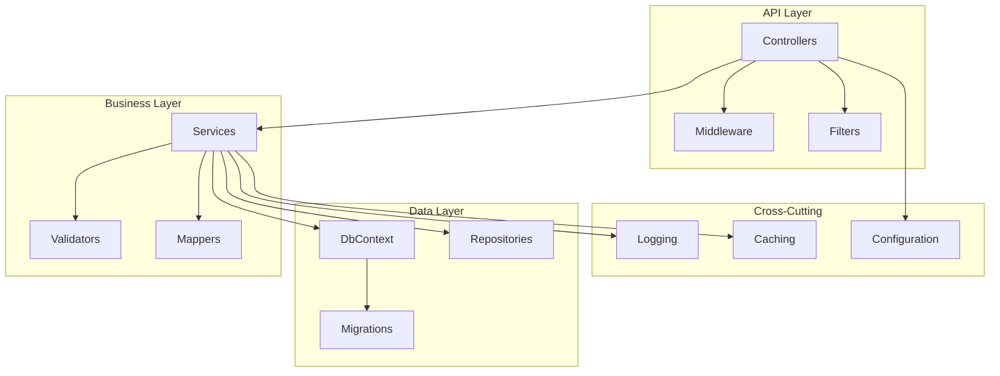
```mermaid
graph TB
    subgraph "API Layer"
        Controllers[Controllers]
        Middleware[Middleware]
        Filters[Filters]
    end
    
    subgraph "Business Layer"
        Services[Services]
        Validators[Validators]
        Mappers[Mappers]
    end
    
    subgraph "Data Layer"
        DbContext[DbContext]
        Repositories[Repositories]
        Migrations[Migrations]
    end
    
    subgraph "Cross-Cutting"
        Logging[Logging]
        Caching[Caching]
        Configuration[Configuration]
    end
    
    Controllers --> Services
    Controllers --> Middleware
    Controllers --> Filters
    
    Services --> Validators
    Services --> Mappers
    Services --> DbContext
    Services --> Repositories
    
    DbContext --> Migrations
    
    Services --> Logging
    Services --> Caching
    Controllers --> Configuration
```

## Diagramy wdrożenia

### Architektura wdrożenia - Docker

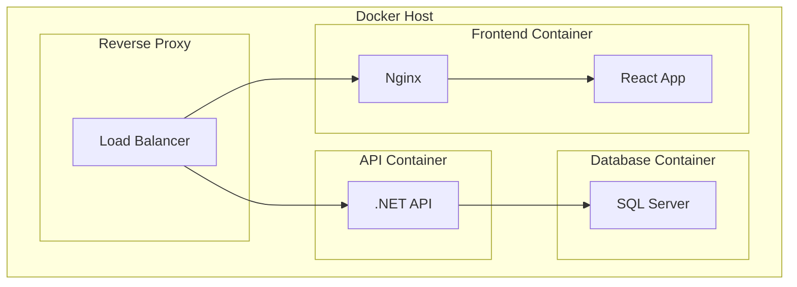
```mermaid
graph TB
    subgraph "Docker Host"
        subgraph "Frontend Container"
            Nginx[Nginx]
            ReactApp[React App]
        end
        
        subgraph "API Container"
            DotNetApp[.NET API]
        end
        
        subgraph "Database Container"
            SqlServer[SQL Server]
        end
        
        subgraph "Reverse Proxy"
            LoadBalancer[Load Balancer]
        end
    end
    
    LoadBalancer --> Nginx
    LoadBalancer --> DotNetApp
    DotNetApp --> SqlServer
    Nginx --> ReactApp
```

### Architektura wdrożenia - Chmura

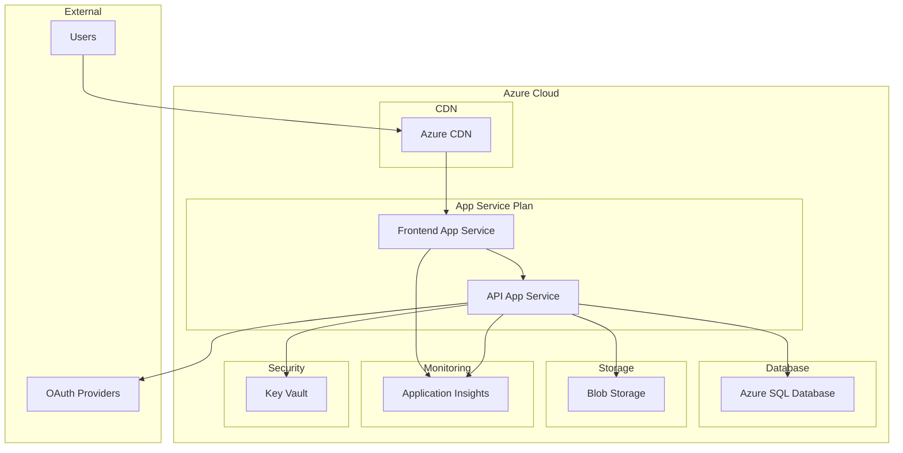
```mermaid
graph TB
    subgraph "Azure Cloud"
        subgraph "App Service Plan"
            WebApp1[Frontend App Service]
            WebApp2[API App Service]
        end
        
        subgraph "Database"
            SqlDatabase[Azure SQL Database]
        end
        
        subgraph "Storage"
            BlobStorage[Blob Storage]
        end
        
        subgraph "Monitoring"
            AppInsights[Application Insights]
        end
        
        subgraph "Security"
            KeyVault[Key Vault]
        end
        
        subgraph "CDN"
            AzureCDN[Azure CDN]
        end
    end
    
    subgraph "External"
        Users[Users]
        OAuth[OAuth Providers]
    end
    
    Users --> AzureCDN
    AzureCDN --> WebApp1
    WebApp1 --> WebApp2
    WebApp2 --> SqlDatabase
    WebApp2 --> BlobStorage
    WebApp2 --> OAuth
    
    WebApp1 --> AppInsights
    WebApp2 --> AppInsights
    WebApp2 --> KeyVault
```

## Diagramy przepływu danych

### Przepływ danych - Dodawanie transakcji

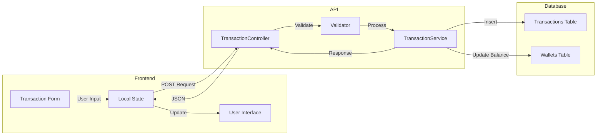
```mermaid
graph LR
    subgraph "Frontend"
        Form[Transaction Form]
        State[Local State]
        UI[User Interface]
    end
    
    subgraph "API"
        Controller[TransactionController]
        Service[TransactionService]
        Validator[Validator]
    end
    
    subgraph "Database"
        TransTable[Transactions Table]
        WalletTable[Wallets Table]
    end
    
    Form -->|User Input| State
    State -->|POST Request| Controller
    Controller -->|Validate| Validator
    Validator -->|Process| Service
    Service -->|Insert| TransTable
    Service -->|Update Balance| WalletTable
    Service -->|Response| Controller
    Controller -->|JSON| State
    State -->|Update| UI
```

### Przepływ danych - Statystyki

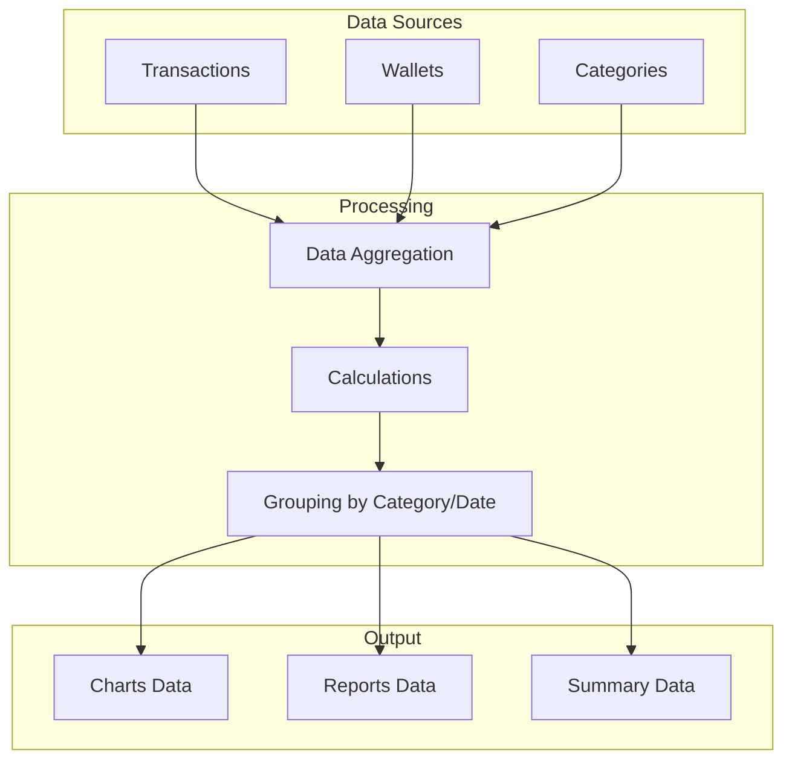
```mermaid
graph TD
    subgraph "Data Sources"
        Transactions[Transactions]
        Wallets[Wallets]
        Categories[Categories]
    end
    
    subgraph "Processing"
        Aggregation[Data Aggregation]
        Calculation[Calculations]
        Grouping[Grouping by Category/Date]
    end
    
    subgraph "Output"
        Charts[Charts Data]
        Reports[Reports Data]
        Summary[Summary Data]
    end
    
    Transactions --> Aggregation
    Wallets --> Aggregation
    Categories --> Aggregation
    
    Aggregation --> Calculation
    Calculation --> Grouping
    
    Grouping --> Charts
    Grouping --> Reports
    Grouping --> Summary
```

### Przepływ uwierzytelniania

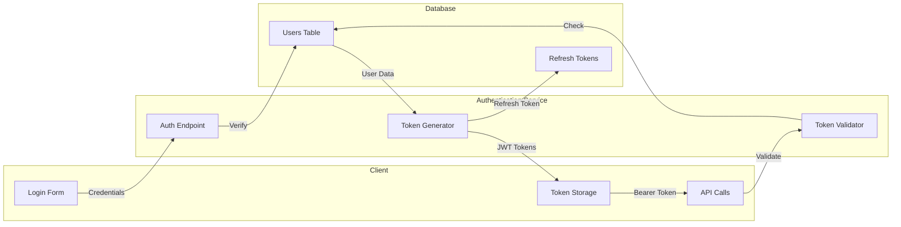
```mermaid
graph LR
    subgraph "Client"
        LoginForm[Login Form]
        TokenStorage[Token Storage]
        ApiCalls[API Calls]
    end
    
    subgraph "Authentication Service"
        AuthEndpoint[Auth Endpoint]
        TokenGenerator[Token Generator]
        TokenValidator[Token Validator]
    end
    
    subgraph "Database"
        UserTable[Users Table]
        TokenTable[Refresh Tokens]
    end
    
    LoginForm -->|Credentials| AuthEndpoint
    AuthEndpoint -->|Verify| UserTable
    UserTable -->|User Data| TokenGenerator
    TokenGenerator -->|JWT Tokens| TokenStorage
    TokenGenerator -->|Refresh Token| TokenTable
    
    TokenStorage -->|Bearer Token| ApiCalls
    ApiCalls -->|Validate| TokenValidator
    TokenValidator -->|Check| UserTable
```
