# Diagramy MyMoney

## Spis treści

1. [Przypadki użycia](#przypadki-użycia)
2. [Flow charty](#flow-charty)
3. [Diagramy sekwencji](#diagramy-sekwencji)
4. [Diagramy stanów](#diagramy-stanów)
5. [Diagramy klas](#diagramy-klas)
6. [Diagramy komponentów](#diagramy-komponentów)
7. [Diagramy wdrożenia](#diagramy-wdrożenia)
8. [Diagramy przepływu danych](#diagramy-przepływu-danych)

## Przypadki użycia

### Główne przypadki użycia systemu

```mermaid
graph TB
    User[👤 Użytkownik]
    
    subgraph "System MyMoney"
        UC1[Rejestracja konta]
        UC2[Logowanie]
        UC3[Zarządzanie profilem]
        UC4[Tworzenie kont finansowych]
        UC5[Dodawanie transakcji]
        UC6[Kategoryzowanie wydatków]
        UC7[Przeglądanie statystyk]
        UC8[Zarządzanie budżetami]
        UC9[Funkcje społecznościowe]
    end
    
    User --> UC1
    User --> UC2
    User --> UC3
    User --> UC4
    User --> UC5
    User --> UC6
    User --> UC7
    User --> UC8
    User --> UC9
```

### Szczegółowe przypadki użycia - Zarządzanie transakcjami

```mermaid
graph LR
    User[👤 Użytkownik]
    
    subgraph "Zarządzanie Transakcjami"
        UC1[Dodaj wydatek]
        UC2[Dodaj przychód]
        UC3[Edytuj transakcję]
        UC4[Usuń transakcję]
    end
    
    subgraph "Kategorie"
        UC5[Wybierz kategorię]
        UC6[Utwórz kategorię]
        UC7[Edytuj kategorię]
        UC8[Usuń kategorię]
    end
    
    User --> UC1
    User --> UC2
    User --> UC3
    User --> UC4
    
    UC1 --> UC5
    UC2 --> UC5
    User --> UC6
    User --> UC7
    User --> UC8
```

## Flow charty

### Proces rejestracji użytkownika

```mermaid
flowchart TD
    Start([Start]) --> Input[Wprowadź email i hasło]
    Input --> ValidateEmail{Email poprawny?}
    ValidateEmail -->|Nie| ErrorEmail[Błąd: Niepoprawny email]
    ErrorEmail --> Input
    
    ValidateEmail -->|Tak| ValidatePassword{Hasło bezpieczne?}
    ValidatePassword -->|Nie| ErrorPassword[Błąd: Hasło za słabe<br/>- 8 znaków<br/>- cyfra<br/>- znak specjalny<br/>- wielka litera<br/>- mała litera]
    ErrorPassword --> Input
    
    ValidatePassword -->|Tak| CheckExists{Użytkownik istnieje?}
    CheckExists -->|Tak| ErrorExists[Błąd: Użytkownik już istnieje]
    ErrorExists --> Input
    
    CheckExists -->|Nie| CreateUser[Utwórz użytkownika]
    CreateUser --> Success[Rejestracja udana]
    Success --> End([Koniec])
```

### Proces dodawania transakcji

```mermaid
flowchart TD
    Start([Start]) --> SelectType{Wybierz typ}
    SelectType -->|Wydatek| ExpenseDialog[Dialog wydatku]
    SelectType -->|Przychód| IncomeDialog[Dialog przychodu]
    
    ExpenseDialog --> FillForm[Wypełnij formularz:<br/>- Kwota<br/>- Kategoria<br/>- Opis<br/>- Data<br/>- Konto]
    IncomeDialog --> FillForm
    
    FillForm --> ValidateAmount{Kwota > 0?}
    ValidateAmount -->|Nie| ErrorAmount[Błąd: Niepoprawna kwota]
    ErrorAmount --> FillForm
    
    ValidateAmount -->|Tak| SaveTransaction[Zapisz transakcję]
    SaveTransaction --> UpdateBalance[Aktualizuj saldo konta]
    UpdateBalance --> ShowSuccess[Pokaż potwierdzenie]
    ShowSuccess --> End([Koniec])
```

### Proces logowania

```mermaid
flowchart TD
    Start([Start]) --> LoginForm[Formularz logowania]
    LoginForm --> EmailLogin[Wprowadź email i hasło]
    
    EmailLogin --> ValidateCredentials{Dane poprawne?}
    ValidateCredentials -->|Nie| ErrorCredentials[Błąd: Niepoprawne dane]
    ErrorCredentials --> LoginForm
    
    ValidateCredentials -->|Tak| GenerateTokens[Generuj tokeny JWT]
    GenerateTokens --> SetSession[Zapisz tokeny w localStorage]
    SetSession --> RedirectDashboard[Przekieruj na dashboard]
    RedirectDashboard --> End([Koniec])
```

## Diagramy sekwencji

### Sekwencja dodawania transakcji

```mermaid
sequenceDiagram
    participant U as Użytkownik
    participant F as Frontend
    participant A as API
    participant DB as Baza Danych
    
    U->>F: Klik "Add Income/Expense"
    F->>U: Pokaż dialog
    U->>F: Wypełnij dane transakcji
    F->>F: Walidacja po stronie klienta
    F->>A: POST /api/transactions
    
    A->>A: Walidacja danych
    A->>A: Sprawdź JWT token
    A->>DB: Sprawdź istnienie konta
    DB-->>A: Dane konta
    
    A->>DB: Zapisz transakcję
    DB-->>A: Potwierdzenie
    A->>DB: Aktualizuj saldo konta
    DB-->>A: Nowe saldo
    
    A-->>F: 201 Created + dane transakcji
    F->>F: Aktualizuj listę transakcji
    F-->>U: Pokaż potwierdzenie
```

### Sekwencja uwierzytelniania JWT

```mermaid
sequenceDiagram
    participant U as Użytkownik
    participant F as Frontend
    participant A as API
    participant DB as Baza Danych
    
    U->>F: Wprowadź email i hasło
    F->>A: POST /api/auth/login
    A->>A: Walidacja danych
    A->>DB: Sprawdź użytkownika
    DB-->>A: Dane użytkownika
    
    A->>A: Weryfikuj hasło (bcrypt)
    A->>A: Generuj Access Token (1h)
    A->>A: Generuj Refresh Token (24h)
    A->>DB: Zapisz Refresh Token
    
    A-->>F: Tokeny JWT
    F->>F: Zapisz tokeny w localStorage
    F-->>U: Przekieruj na dashboard
```

### Sekwencja odświeżania tokenu

```mermaid
sequenceDiagram
    participant F as Frontend
    participant A as API
    participant DB as Baza Danych
    
    F->>A: GET /api/transactions (wygasły token)
    A-->>F: 401 Unauthorized
    
    F->>F: Sprawdź Refresh Token
    F->>A: POST /api/auth/refresh
    A->>A: Walidacja Refresh Token
    A->>DB: Sprawdź token w bazie
    DB-->>A: Token ważny
    
    A->>A: Generuj nowy Access Token
    A->>A: Generuj nowy Refresh Token
    A->>DB: Aktualizuj Refresh Token
    
    A-->>F: Nowe tokeny
    F->>F: Aktualizuj localStorage
    F->>A: Powtórz oryginalne żądanie
    A-->>F: Dane transakcji
```

## Diagramy stanów

### Stany transakcji

```mermaid
stateDiagram-v2
    [*] --> Creating: Otwórz dialog
    Creating --> Validating: Wypełnij formularz
    Validating --> Creating: Błędy walidacji
    Validating --> Saving: Dane poprawne
    Saving --> Saved: Zapisano pomyślnie
    Saving --> Error: Błąd zapisu
    Error --> Creating: Spróbuj ponownie
    Saved --> Editing: Kliknij Edit
    Editing --> Validating: Zapisz zmiany
    Saved --> Deleting: Kliknij Delete
    Deleting --> Deleted: Potwierdź usunięcie
    Deleting --> Saved: Anuluj usunięcie
    Deleted --> [*]
```

### Stany sesji użytkownika

```mermaid
stateDiagram-v2
    [*] --> Anonymous: Wejście na stronę
    Anonymous --> Authenticating: Rozpocznij logowanie
    Authenticating --> Authenticated: Logowanie udane
    Authenticating --> Anonymous: Logowanie nieudane
    
    Authenticated --> Active: Aktywność użytkownika
    Active --> TokenExpiring: Token wygasa (1h)
    TokenExpiring --> Refreshing: Odśwież token
    Refreshing --> Authenticated: Token odświeżony
    Refreshing --> Anonymous: Odświeżenie nieudane
    
    Authenticated --> LoggingOut: Wyloguj
    LoggingOut --> Anonymous: Wylogowano
    Anonymous --> [*]: Opuść stronę
```

### Stany konta finansowego

```mermaid
stateDiagram-v2
    [*] --> Creating: Tworzenie konta
    Creating --> Active: Konto utworzone
    Creating --> [*]: Anulowano tworzenie
    
    Active --> Updating: Edycja konta
    Updating --> Active: Zmiany zapisane
    Updating --> Active: Anulowano zmiany
    
    Active --> Deleting: Usuń konto
    Deleting --> [*]: Konto usunięte
    Deleting --> Active: Anulowano usunięcie
```

## Diagramy klas

### Model domenowy - Główne klasy

```mermaid
classDiagram
    class User {
        +Guid Id
        +string Email
        +string HashedPassword
        +string RefreshToken
        +DateTime RefreshTokenExpiration
        +string FullName
        +string ProfileImageUrl
        +DateTime CreatedAt
    }
    
    class Wallet {
        +Guid Id
        +string Name
        +string Type
        +decimal InitialBalance
        +decimal ManualBalance
        +string Currency
        +Guid CreatedByUserId
        +DateTime CreatedAt
        +DateTime UpdatedAt
        +CalculateCurrentBalance() decimal
    }
    
    class Transaction {
        +Guid Id
        +Guid WalletId
        +Guid CategoryId
        +Guid UserId
        +decimal Amount
        +string Description
        +DateTime CreatedAt
        +DateTime UpdatedAt
    }
    
    class Category {
        +Guid Id
        +string Name
        +Guid UserId
        +bool IsGlobal
    }
    
    User ||--o{ Wallet : creates
    User ||--o{ Transaction : creates
    User ||--o{ Category : creates
    Wallet ||--o{ Transaction : contains
    Category ||--o{ Transaction : categorizes
```

### Kontrolery API


## Diagramy komponentów

### Architektura frontendu


### Architektura backendu


## Diagramy wdrożenia

### Architektura wdrożenia - Docker


### Architektura wdrożenia - Chmura


## Diagramy przepływu danych

### Przepływ danych - Dodawanie transakcji


### Przepływ danych - Statystyki


### Przepływ uwierzytelniania


