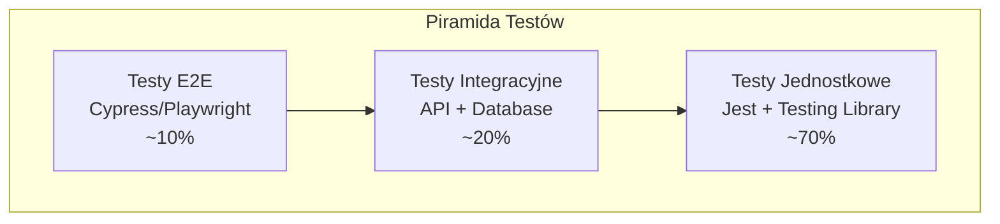

# Testowanie MyMoney

## Strategia testowania

MyMoney wykorzystuje wielopoziomową strategię testowania obejmującą testy jednostkowe, integracyjne, end-to-end oraz testy wydajnościowe. Celem jest zapewnienie wysokiej jakości kodu i niezawodności aplikacji.

## Piramida testów



## Narzędzia testowe

### Frontend
- **Jest** - Framework testowy
- **React Testing Library** - Testowanie komponentów React
- **MSW (Mock Service Worker)** - Mockowanie API
- **Cypress** - Testy E2E
- **Storybook** - Testowanie wizualne komponentów

### Backend
- **xUnit** - Framework testowy dla .NET
- **Moq** - Biblioteka do mockowania
- **FluentAssertions** - Czytelne asercje
- **TestContainers** - Testowanie z prawdziwą bazą danych
- **WebApplicationFactory** - Testy integracyjne API

## Testy jednostkowe

### Frontend - Komponenty React

#### Przykład testu komponentu TransactionForm

```typescript
// TransactionForm.test.tsx
import { render, screen, fireEvent, waitFor } from '@testing-library/react';
import userEvent from '@testing-library/user-event';
import { TransactionForm } from '../TransactionForm';
import { QueryClient, QueryClientProvider } from '@tanstack/react-query';

const createWrapper = () => {
  const queryClient = new QueryClient({
    defaultOptions: {
      queries: { retry: false },
      mutations: { retry: false },
    },
  });
  
  return ({ children }: { children: React.ReactNode }) => (
    <QueryClientProvider client={queryClient}>
      {children}
    </QueryClientProvider>
  );
};

const mockOnSubmit = jest.fn();
const mockOnCancel = jest.fn();

const defaultProps = {
  onSubmit: mockOnSubmit,
  onCancel: mockOnCancel,
};

describe('TransactionForm', () => {
  beforeEach(() => {
    jest.clearAllMocks();
  });

  it('renders all form fields', () => {
    render(<TransactionForm {...defaultProps} />, { wrapper: createWrapper() });
    
    expect(screen.getByLabelText(/kwota/i)).toBeInTheDocument();
    expect(screen.getByLabelText(/opis/i)).toBeInTheDocument();
    expect(screen.getByLabelText(/kategoria/i)).toBeInTheDocument();
    expect(screen.getByLabelText(/data/i)).toBeInTheDocument();
  });

  it('validates required fields', async () => {
    const user = userEvent.setup();
    render(<TransactionForm {...defaultProps} />, { wrapper: createWrapper() });
    
    const submitButton = screen.getByRole('button', { name: /zapisz/i });
    await user.click(submitButton);
    
    expect(await screen.findByText(/kwota jest wymagana/i)).toBeInTheDocument();
    expect(await screen.findByText(/kategoria jest wymagana/i)).toBeInTheDocument();
  });

  it('submits form with valid data', async () => {
    const user = userEvent.setup();
    render(<TransactionForm {...defaultProps} />, { wrapper: createWrapper() });
    
    await user.type(screen.getByLabelText(/kwota/i), '100.50');
    await user.type(screen.getByLabelText(/opis/i), 'Test transaction');
    await user.selectOptions(screen.getByLabelText(/kategoria/i), 'food');
    
    const submitButton = screen.getByRole('button', { name: /zapisz/i });
    await user.click(submitButton);
    
    await waitFor(() => {
      expect(mockOnSubmit).toHaveBeenCalledWith(
        expect.objectContaining({
          amount: 100.50,
          description: 'Test transaction',
          categoryId: 'food',
        })
      );
    });
  });

  it('calls onCancel when cancel button is clicked', async () => {
    const user = userEvent.setup();
    render(<TransactionForm {...defaultProps} />, { wrapper: createWrapper() });
    
    const cancelButton = screen.getByRole('button', { name: /anuluj/i });
    await user.click(cancelButton);
    
    expect(mockOnCancel).toHaveBeenCalledTimes(1);
  });

  it('populates form when editing existing transaction', () => {
    const existingTransaction = {
      id: '1',
      amount: 50.25,
      description: 'Existing transaction',
      categoryId: 'transport',
      date: new Date('2024-01-15'),
    };
    
    render(
      <TransactionForm {...defaultProps} initialData={existingTransaction} />,
      { wrapper: createWrapper() }
    );
    
    expect(screen.getByDisplayValue('50.25')).toBeInTheDocument();
    expect(screen.getByDisplayValue('Existing transaction')).toBeInTheDocument();
  });
});
```

#### Testowanie custom hooks

```typescript
// useTransactions.test.ts
import { renderHook, waitFor } from '@testing-library/react';
import { QueryClient, QueryClientProvider } from '@tanstack/react-query';
import { useTransactions } from '../useTransactions';
import { transactionService } from '../../services/transactionService';

jest.mock('../../services/transactionService');
const mockTransactionService = transactionService as jest.Mocked<typeof transactionService>;

const createWrapper = () => {
  const queryClient = new QueryClient({
    defaultOptions: {
      queries: { retry: false },
      mutations: { retry: false },
    },
  });
  
  return ({ children }: { children: React.ReactNode }) => (
    <QueryClientProvider client={queryClient}>
      {children}
    </QueryClientProvider>
  );
};

describe('useTransactions', () => {
  beforeEach(() => {
    jest.clearAllMocks();
  });

  it('fetches transactions successfully', async () => {
    const mockTransactions = [
      { id: '1', amount: 100, description: 'Test 1' },
      { id: '2', amount: 200, description: 'Test 2' },
    ];
    
    mockTransactionService.getTransactions.mockResolvedValue({
      transactions: mockTransactions,
      totalCount: 2,
      page: 1,
      pageSize: 10,
      totalPages: 1,
    });

    const { result } = renderHook(() => useTransactions(), {
      wrapper: createWrapper(),
    });

    await waitFor(() => {
      expect(result.current.loading).toBe(false);
    });

    expect(result.current.transactions).toEqual(mockTransactions);
    expect(result.current.totalCount).toBe(2);
  });

  it('handles error when fetching transactions fails', async () => {
    mockTransactionService.getTransactions.mockRejectedValue(
      new Error('Network error')
    );

    const { result } = renderHook(() => useTransactions(), {
      wrapper: createWrapper(),
    });

    await waitFor(() => {
      expect(result.current.loading).toBe(false);
    });

    expect(result.current.error).toBe('Network error');
    expect(result.current.transactions).toEqual([]);
  });
});
```

### Backend - Testy jednostkowe .NET

#### Testowanie kontrolerów

```csharp
// TransactionsControllerTests.cs
using Microsoft.AspNetCore.Mvc;
using Moq;
using FluentAssertions;
using Xunit;

public class TransactionsControllerTests
{
    private readonly Mock<ITransactionService> _mockTransactionService;
    private readonly Mock<ILogger<TransactionsController>> _mockLogger;
    private readonly TransactionsController _controller;

    public TransactionsControllerTests()
    {
        _mockTransactionService = new Mock<ITransactionService>();
        _mockLogger = new Mock<ILogger<TransactionsController>>();
        _controller = new TransactionsController(_mockTransactionService.Object, _mockLogger.Object);
        
        // Setup user context
        var claims = new List<Claim>
        {
            new Claim(ClaimTypes.NameIdentifier, "test-user-id")
        };
        var identity = new ClaimsIdentity(claims, "Test");
        var principal = new ClaimsPrincipal(identity);
        
        _controller.ControllerContext = new ControllerContext
        {
            HttpContext = new DefaultHttpContext { User = principal }
        };
    }

    [Fact]
    public async Task GetTransactions_ReturnsOkResult_WithTransactions()
    {
        // Arrange
        var userId = Guid.Parse("test-user-id");
        var transactions = new List<Transaction>
        {
            new Transaction { Id = Guid.NewGuid(), Amount = 100, Description = "Test 1" },
            new Transaction { Id = Guid.NewGuid(), Amount = 200, Description = "Test 2" }
        };
        
        var response = new TransactionsResponse
        {
            Transactions = transactions,
            TotalCount = 2,
            Page = 1,
            PageSize = 10,
            TotalPages = 1
        };

        _mockTransactionService
            .Setup(s => s.GetTransactionsAsync(userId, It.IsAny<TransactionFilters>()))
            .ReturnsAsync(response);

        // Act
        var result = await _controller.GetTransactions(new TransactionFilters());

        // Assert
        result.Should().BeOfType<OkObjectResult>();
        var okResult = result as OkObjectResult;
        okResult.Value.Should().BeEquivalentTo(response);
    }

    [Fact]
    public async Task CreateTransaction_WithValidData_ReturnsCreatedResult()
    {
        // Arrange
        var userId = Guid.Parse("test-user-id");
        var request = new CreateTransactionRequest
        {
            WalletId = Guid.NewGuid(),
            CategoryId = Guid.NewGuid(),
            Amount = 100.50m,
            Description = "Test transaction",
            Type = TransactionType.Expense
        };

        var createdTransaction = new Transaction
        {
            Id = Guid.NewGuid(),
            WalletId = request.WalletId,
            CategoryId = request.CategoryId,
            Amount = request.Amount,
            Description = request.Description,
            Type = request.Type
        };

        _mockTransactionService
            .Setup(s => s.CreateTransactionAsync(userId, request))
            .ReturnsAsync(createdTransaction);

        // Act
        var result = await _controller.CreateTransaction(request);

        // Assert
        result.Should().BeOfType<CreatedAtActionResult>();
        var createdResult = result as CreatedAtActionResult;
        createdResult.Value.Should().BeEquivalentTo(createdTransaction);
    }

    [Fact]
    public async Task CreateTransaction_WithInvalidData_ReturnsBadRequest()
    {
        // Arrange
        var request = new CreateTransactionRequest(); // Invalid - missing required fields
        _controller.ModelState.AddModelError("Amount", "Amount is required");

        // Act
        var result = await _controller.CreateTransaction(request);

        // Assert
        result.Should().BeOfType<BadRequestObjectResult>();
    }

    [Fact]
    public async Task DeleteTransaction_WithValidId_ReturnsNoContent()
    {
        // Arrange
        var userId = Guid.Parse("test-user-id");
        var transactionId = Guid.NewGuid();

        _mockTransactionService
            .Setup(s => s.DeleteTransactionAsync(userId, transactionId))
            .Returns(Task.CompletedTask);

        // Act
        var result = await _controller.DeleteTransaction(transactionId);

        // Assert
        result.Should().BeOfType<NoContentResult>();
    }

    [Fact]
    public async Task DeleteTransaction_WithNonExistentId_ReturnsNotFound()
    {
        // Arrange
        var userId = Guid.Parse("test-user-id");
        var transactionId = Guid.NewGuid();

        _mockTransactionService
            .Setup(s => s.DeleteTransactionAsync(userId, transactionId))
            .ThrowsAsync(new NotFoundException("Transaction not found"));

        // Act
        var result = await _controller.DeleteTransaction(transactionId);

        // Assert
        result.Should().BeOfType<NotFoundObjectResult>();
    }
}
```

#### Testowanie serwisów

```csharp
// TransactionServiceTests.cs
using Microsoft.EntityFrameworkCore;
using FluentAssertions;
using Xunit;

public class TransactionServiceTests : IDisposable
{
    private readonly ApplicationDbContext _context;
    private readonly TransactionService _service;
    private readonly Mock<ILogger<TransactionService>> _mockLogger;

    public TransactionServiceTests()
    {
        var options = new DbContextOptionsBuilder<ApplicationDbContext>()
            .UseInMemoryDatabase(databaseName: Guid.NewGuid().ToString())
            .Options;

        _context = new ApplicationDbContext(options);
        _mockLogger = new Mock<ILogger<TransactionService>>();
        _service = new TransactionService(_context, _mockLogger.Object);

        SeedTestData();
    }

    private void SeedTestData()
    {
        var user = new User
        {
            Id = Guid.Parse("test-user-id"),
            Email = "test@example.com",
            HashedPassword = "hashed-password"
        };

        var wallet = new Wallet
        {
            Id = Guid.Parse("test-wallet-id"),
            Name = "Test Wallet",
            CreatedByUserId = user.Id,
            InitialBalance = 1000m
        };

        var category = new Category
        {
            Id = Guid.Parse("test-category-id"),
            Name = "Test Category",
            Type = CategoryType.Expense,
            IsDefault = true
        };

        _context.Users.Add(user);
        _context.Wallets.Add(wallet);
        _context.Categories.Add(category);
        _context.SaveChanges();
    }

    [Fact]
    public async Task CreateTransactionAsync_WithValidData_CreatesTransaction()
    {
        // Arrange
        var userId = Guid.Parse("test-user-id");
        var request = new CreateTransactionRequest
        {
            WalletId = Guid.Parse("test-wallet-id"),
            CategoryId = Guid.Parse("test-category-id"),
            Amount = -50.25m,
            Description = "Test expense",
            Type = TransactionType.Expense,
            Date = DateTime.UtcNow
        };

        // Act
        var result = await _service.CreateTransactionAsync(userId, request);

        // Assert
        result.Should().NotBeNull();
        result.Amount.Should().Be(-50.25m);
        result.Description.Should().Be("Test expense");
        result.Type.Should().Be(TransactionType.Expense);

        var transactionInDb = await _context.Transactions.FindAsync(result.Id);
        transactionInDb.Should().NotBeNull();
    }

    [Fact]
    public async Task CreateTransactionAsync_WithNonExistentWallet_ThrowsNotFoundException()
    {
        // Arrange
        var userId = Guid.Parse("test-user-id");
        var request = new CreateTransactionRequest
        {
            WalletId = Guid.NewGuid(), // Non-existent wallet
            CategoryId = Guid.Parse("test-category-id"),
            Amount = -50.25m,
            Description = "Test expense",
            Type = TransactionType.Expense
        };

        // Act & Assert
        await Assert.ThrowsAsync<NotFoundException>(
            () => _service.CreateTransactionAsync(userId, request)
        );
    }

    [Fact]
    public async Task GetTransactionsAsync_WithFilters_ReturnsFilteredResults()
    {
        // Arrange
        var userId = Guid.Parse("test-user-id");
        var walletId = Guid.Parse("test-wallet-id");
        var categoryId = Guid.Parse("test-category-id");

        // Create test transactions
        var transactions = new List<Transaction>
        {
            new Transaction
            {
                Id = Guid.NewGuid(),
                WalletId = walletId,
                CategoryId = categoryId,
                Amount = -100m,
                Description = "Expense 1",
                Type = TransactionType.Expense,
                Date = DateTime.UtcNow.AddDays(-1)
            },
            new Transaction
            {
                Id = Guid.NewGuid(),
                WalletId = walletId,
                CategoryId = categoryId,
                Amount = 200m,
                Description = "Income 1",
                Type = TransactionType.Income,
                Date = DateTime.UtcNow.AddDays(-2)
            }
        };

        _context.Transactions.AddRange(transactions);
        await _context.SaveChangesAsync();

        var filters = new TransactionFilters
        {
            WalletId = walletId,
            Type = TransactionType.Expense,
            Page = 1,
            PageSize = 10
        };

        // Act
        var result = await _service.GetTransactionsAsync(userId, filters);

        // Assert
        result.Should().NotBeNull();
        result.Transactions.Should().HaveCount(1);
        result.Transactions.First().Type.Should().Be(TransactionType.Expense);
        result.TotalCount.Should().Be(1);
    }

    public void Dispose()
    {
        _context.Dispose();
    }
}
```

## Testy integracyjne

### Backend - Testy API

```csharp
// TransactionsIntegrationTests.cs
using Microsoft.AspNetCore.Mvc.Testing;
using Microsoft.Extensions.DependencyInjection;
using System.Net.Http.Json;
using FluentAssertions;
using Xunit;

public class TransactionsIntegrationTests : IClassFixture<WebApplicationFactory<Program>>
{
    private readonly WebApplicationFactory<Program> _factory;
    private readonly HttpClient _client;

    public TransactionsIntegrationTests(WebApplicationFactory<Program> factory)
    {
        _factory = factory;
        _client = _factory.CreateClient();
    }

    [Fact]
    public async Task GetTransactions_WithValidToken_ReturnsTransactions()
    {
        // Arrange
        var token = await GetValidJwtToken();
        _client.DefaultRequestHeaders.Authorization = 
            new System.Net.Http.Headers.AuthenticationHeaderValue("Bearer", token);

        // Act
        var response = await _client.GetAsync("/api/transactions");

        // Assert
        response.StatusCode.Should().Be(HttpStatusCode.OK);
        
        var content = await response.Content.ReadFromJsonAsync<TransactionsResponse>();
        content.Should().NotBeNull();
        content.Transactions.Should().NotBeNull();
    }

    [Fact]
    public async Task CreateTransaction_WithValidData_ReturnsCreated()
    {
        // Arrange
        var token = await GetValidJwtToken();
        _client.DefaultRequestHeaders.Authorization = 
            new System.Net.Http.Headers.AuthenticationHeaderValue("Bearer", token);

        var request = new CreateTransactionRequest
        {
            WalletId = await GetTestWalletId(),
            CategoryId = await GetTestCategoryId(),
            Amount = -75.50m,
            Description = "Integration test transaction",
            Type = TransactionType.Expense,
            Date = DateTime.UtcNow
        };

        // Act
        var response = await _client.PostAsJsonAsync("/api/transactions", request);

        // Assert
        response.StatusCode.Should().Be(HttpStatusCode.Created);
        
        var transaction = await response.Content.ReadFromJsonAsync<Transaction>();
        transaction.Should().NotBeNull();
        transaction.Amount.Should().Be(-75.50m);
        transaction.Description.Should().Be("Integration test transaction");
    }

    [Fact]
    public async Task CreateTransaction_WithoutToken_ReturnsUnauthorized()
    {
        // Arrange
        var request = new CreateTransactionRequest
        {
            Amount = -50m,
            Description = "Test"
        };

        // Act
        var response = await _client.PostAsJsonAsync("/api/transactions", request);

        // Assert
        response.StatusCode.Should().Be(HttpStatusCode.Unauthorized);
    }

    private async Task<string> GetValidJwtToken()
    {
        var loginRequest = new LoginRequest
        {
            Email = "test@example.com",
            Password = "TestPassword123!"
        };

        var response = await _client.PostAsJsonAsync("/api/auth/login", loginRequest);
        var loginResponse = await response.Content.ReadFromJsonAsync<LoginResponse>();
        
        return loginResponse.AccessToken;
    }

    private async Task<Guid> GetTestWalletId()
    {
        // Implementation to get test wallet ID
        return Guid.Parse("test-wallet-id");
    }

    private async Task<Guid> GetTestCategoryId()
    {
        // Implementation to get test category ID
        return Guid.Parse("test-category-id");
    }
}
```

### Frontend - Testy integracyjne z MSW

```typescript
// api.integration.test.ts
import { rest } from 'msw';
import { setupServer } from 'msw/node';
import { transactionService } from '../services/transactionService';

const server = setupServer(
  rest.get('/api/transactions', (req, res, ctx) => {
    return res(
      ctx.json({
        transactions: [
          { id: '1', amount: -100, description: 'Test expense' },
          { id: '2', amount: 200, description: 'Test income' }
        ],
        totalCount: 2,
        page: 1,
        pageSize: 10,
        totalPages: 1
      })
    );
  }),

  rest.post('/api/transactions', (req, res, ctx) => {
    return res(
      ctx.status(201),
      ctx.json({
        id: '3',
        amount: -50,
        description: 'New transaction'
      })
    );
  }),

  rest.delete('/api/transactions/:id', (req, res, ctx) => {
    return res(ctx.status(204));
  })
);

beforeAll(() => server.listen());
afterEach(() => server.resetHandlers());
afterAll(() => server.close());

describe('Transaction Service Integration', () => {
  it('fetches transactions from API', async () => {
    const result = await transactionService.getTransactions();
    
    expect(result.transactions).toHaveLength(2);
    expect(result.totalCount).toBe(2);
  });

  it('creates new transaction', async () => {
    const newTransaction = {
      walletId: 'wallet-1',
      categoryId: 'category-1',
      amount: -50,
      description: 'New transaction',
      type: 'Expense' as const,
      date: new Date()
    };

    const result = await transactionService.createTransaction(newTransaction);
    
    expect(result.id).toBe('3');
    expect(result.amount).toBe(-50);
  });

  it('deletes transaction', async () => {
    await expect(
      transactionService.deleteTransaction('1')
    ).resolves.not.toThrow();
  });
});
```

## Testy End-to-End

### Cypress - Testy E2E

```typescript
// cypress/e2e/transactions.cy.ts
describe('Transaction Management', () => {
  beforeEach(() => {
    cy.login('test@example.com', 'password123');
    cy.visit('/transactions');
  });

  it('displays transaction list', () => {
    cy.get('[data-testid="transaction-list"]').should('be.visible');
    cy.get('[data-testid="transaction-item"]').should('have.length.at.least', 1);
  });

  it('creates new expense transaction', () => {
    cy.get('[data-testid="add-transaction-btn"]').click();
    
    cy.get('[data-testid="transaction-form"]').should('be.visible');
    cy.get('[data-testid="amount-input"]').type('75.50');
    cy.get('[data-testid="description-input"]').type('Grocery shopping');
    cy.get('[data-testid="category-select"]').select('Jedzenie');
    cy.get('[data-testid="type-expense"]').check();
    
    cy.get('[data-testid="submit-btn"]').click();
    
    cy.get('[data-testid="success-message"]').should('contain', 'Transakcja została dodana');
    cy.get('[data-testid="transaction-list"]').should('contain', 'Grocery shopping');
  });

  it('edits existing transaction', () => {
    cy.get('[data-testid="transaction-item"]').first().click();
    cy.get('[data-testid="edit-btn"]').click();
    
    cy.get('[data-testid="description-input"]').clear().type('Updated description');
    cy.get('[data-testid="submit-btn"]').click();
    
    cy.get('[data-testid="success-message"]').should('contain', 'Transakcja została zaktualizowana');
    cy.get('[data-testid="transaction-list"]').should('contain', 'Updated description');
  });

  it('deletes transaction', () => {
    cy.get('[data-testid="transaction-item"]').first().click();
    cy.get('[data-testid="delete-btn"]').click();
    
    cy.get('[data-testid="confirm-dialog"]').should('be.visible');
    cy.get('[data-testid="confirm-delete-btn"]').click();
    
    cy.get('[data-testid="success-message"]').should('contain', 'Transakcja została usunięta');
  });

  it('filters transactions by category', () => {
    cy.get('[data-testid="category-filter"]').select('Jedzenie');
    cy.get('[data-testid="apply-filters-btn"]').click();
    
    cy.get('[data-testid="transaction-item"]').each(($item) => {
      cy.wrap($item).should('contain', 'Jedzenie');
    });
  });

  it('searches transactions by description', () => {
    cy.get('[data-testid="search-input"]').type('grocery');
    
    cy.get('[data-testid="transaction-item"]').each(($item) => {
      cy.wrap($item).should('contain.text', 'grocery');
    });
  });
});

// cypress/e2e/auth.cy.ts
describe('Authentication', () => {
  it('logs in with valid credentials', () => {
    cy.visit('/auth/login');
    
    cy.get('[data-testid="email-input"]').type('test@example.com');
    cy.get('[data-testid="password-input"]').type('password123');
    cy.get('[data-testid="login-btn"]').click();
    
    cy.url().should('eq', Cypress.config().baseUrl + '/');
    cy.get('[data-testid="user-menu"]').should('be.visible');
  });

  it('shows error with invalid credentials', () => {
    cy.visit('/auth/login');
    
    cy.get('[data-testid="email-input"]').type('test@example.com');
    cy.get('[data-testid="password-input"]').type('wrongpassword');
    cy.get('[data-testid="login-btn"]').click();
    
    cy.get('[data-testid="error-message"]').should('contain', 'Nieprawidłowe dane logowania');
  });

  it('registers new user', () => {
    cy.visit('/auth/register');
    
    cy.get('[data-testid="email-input"]').type('newuser@example.com');
    cy.get('[data-testid="password-input"]').type('newpassword123');
    cy.get('[data-testid="confirm-password-input"]').type('newpassword123');
    cy.get('[data-testid="register-btn"]').click();
    
    cy.get('[data-testid="success-message"]').should('contain', 'Konto zostało utworzone');
  });
});
```

### Cypress - Komendy pomocnicze

```typescript
// cypress/support/commands.ts
declare global {
  namespace Cypress {
    interface Chainable {
      login(email: string, password: string): Chainable<void>;
      createTransaction(transaction: any): Chainable<void>;
      deleteAllTransactions(): Chainable<void>;
    }
  }
}

Cypress.Commands.add('login', (email: string, password: string) => {
  cy.request({
    method: 'POST',
    url: '/api/auth/login',
    body: { email, password }
  }).then((response) => {
    window.localStorage.setItem('accessToken', response.body.accessToken);
    window.localStorage.setItem('refreshToken', response.body.refreshToken);
  });
});

Cypress.Commands.add('createTransaction', (transaction) => {
  cy.request({
    method: 'POST',
    url: '/api/transactions',
    body: transaction,
    headers: {
      Authorization: `Bearer ${window.localStorage.getItem('accessToken')}`
    }
  });
});

Cypress.Commands.add('deleteAllTransactions', () => {
  cy.request({
    method: 'GET',
    url: '/api/transactions',
    headers: {
      Authorization: `Bearer ${window.localStorage.getItem('accessToken')}`
    }
  }).then((response) => {
    response.body.transactions.forEach((transaction: any) => {
      cy.request({
        method: 'DELETE',
        url: `/api/transactions/${transaction.id}`,
        headers: {
          Authorization: `Bearer ${window.localStorage.getItem('accessToken')}`
        }
      });
    });
  });
});
```

## Testy wydajnościowe

### K6 - Testy obciążeniowe API

```javascript
// performance/load-test.js
import http from 'k6/http';
import { check, sleep } from 'k6';
import { Rate } from 'k6/metrics';

export let errorRate = new Rate('errors');

export let options = {
  stages: [
    { duration: '2m', target: 10 }, // Ramp up
    { duration: '5m', target: 10 }, // Stay at 10 users
    { duration: '2m', target: 20 }, // Ramp up to 20 users
    { duration: '5m', target: 20 }, // Stay at 20 users
    { duration: '2m', target: 0 },  // Ramp down
  ],
  thresholds: {
    http_req_duration: ['p(95)<500'], // 95% of requests must complete below 500ms
    errors: ['rate<0.1'], // Error rate must be below 10%
  },
};

const BASE_URL = 'https://localhost:7001/api';

export function setup() {
  // Login and get token
  const loginResponse = http.post(`${BASE_URL}/auth/login`, {
    email: 'test@example.com',
    password: 'password123'
  });
  
  return { token: loginResponse.json('accessToken') };
}

export default function(data) {
  const headers = {
    'Authorization': `Bearer ${data.token}`,
    'Content-Type': 'application/json',
  };

  // Test getting transactions
  let response = http.get(`${BASE_URL}/transactions`, { headers });
  check(response, {
    'get transactions status is 200': (r) => r.status === 200,
    'get transactions response time < 500ms': (r) => r.timings.duration < 500,
  }) || errorRate.add(1);

  sleep(1);

  // Test creating transaction
  const transactionData = {
    walletId: 'test-wallet-id',
    categoryId: 'test-category-id',
    amount: -Math.random() * 100,
    description: `Load test transaction ${Math.random()}`,
    type: 'Expense',
    date: new Date().toISOString()
  };

  response = http.post(`${BASE_URL}/transactions`, JSON.stringify(transactionData), { headers });
  check(response, {
    'create transaction status is 201': (r) => r.status === 201,
    'create transaction response time < 1000ms': (r) => r.timings.duration < 1000,
  }) || errorRate.add(1);

  sleep(1);
}
```

## Pokrycie kodu

### Frontend - Jest Coverage

```json
// package.json
{
  "scripts": {
    "test:coverage": "jest --coverage --watchAll=false"
  },
  "jest": {
    "collectCoverageFrom": [
      "src/**/*.{ts,tsx}",
      "!src/**/*.d.ts",
      "!src/index.tsx",
      "!src/reportWebVitals.ts"
    ],
    "coverageThreshold": {
      "global": {
        "branches": 80,
        "functions": 80,
        "lines": 80,
        "statements": 80
      }
    }
  }
}
```

### Backend - .NET Coverage

```xml
<!-- Directory.Build.props -->
<Project>
  <PropertyGroup>
    <CollectCoverage>true</CollectCoverage>
    <CoverletOutputFormat>opencover</CoverletOutputFormat>
    <CoverletOutput>./coverage/</CoverletOutput>
    <Threshold>80</Threshold>
    <ThresholdType>line</ThresholdType>
    <ThresholdStat>total</ThresholdStat>
  </PropertyGroup>
</Project>
```

## CI/CD Pipeline testów

### GitHub Actions

```yaml
# .github/workflows/tests.yml
name: Tests

on:
  push:
    branches: [ main, develop ]
  pull_request:
    branches: [ main ]

jobs:
  frontend-tests:
    runs-on: ubuntu-latest
    steps:
    - uses: actions/checkout@v3
    
    - name: Setup Node.js
      uses: actions/setup-node@v3
      with:
        node-version: '18'
        cache: 'npm'
        cache-dependency-path: frontend/package-lock.json
    
    - name: Install dependencies
      run: npm ci
      working-directory: frontend
    
    - name: Run unit tests
      run: npm run test:coverage
      working-directory: frontend
    
    - name: Upload coverage to Codecov
      uses: codecov/codecov-action@v3
      with:
        file: frontend/coverage/lcov.info
        flags: frontend

  backend-tests:
    runs-on: ubuntu-latest
    services:
      sqlserver:
        image: mcr.microsoft.com/mssql/server:2019-latest
        env:
          ACCEPT_EULA: Y
          SA_PASSWORD: TestPassword123!
        ports:
          - 1433:1433
    
    steps:
    - uses: actions/checkout@v3
    
    - name: Setup .NET
      uses: actions/setup-dotnet@v3
      with:
        dotnet-version: '9.0.x'
    
    - name: Restore dependencies
      run: dotnet restore
      working-directory: api
    
    - name: Run unit tests
      run: dotnet test --collect:"XPlat Code Coverage"
      working-directory: api
    
    - name: Upload coverage to Codecov
      uses: codecov/codecov-action@v3
      with:
        file: api/TestResults/*/coverage.cobertura.xml
        flags: backend

  e2e-tests:
    runs-on: ubuntu-latest
    needs: [frontend-tests, backend-tests]
    steps:
    - uses: actions/checkout@v3
    
    - name: Setup Node.js
      uses: actions/setup-node@v3
      with:
        node-version: '18'
    
    - name: Setup .NET
      uses: actions/setup-dotnet@v3
      with:
        dotnet-version: '9.0.x'
    
    - name: Start application
      run: docker-compose up -d
    
    - name: Wait for application
      run: npx wait-on http://localhost:3000
    
    - name: Run Cypress tests
      uses: cypress-io/github-action@v5
      with:
        working-directory: frontend
        wait-on: 'http://localhost:3000'
        wait-on-timeout: 120
```

## Najlepsze praktyki testowania

### 1. Struktura testów (AAA Pattern)
```typescript
describe('Component', () => {
  it('should do something', () => {
    // Arrange - przygotowanie danych testowych
    const props = { ... };
    
    // Act - wykonanie akcji
    render(<Component {...props} />);
    fireEvent.click(screen.getByRole('button'));
    
    // Assert - sprawdzenie rezultatu
    expect(screen.getByText('Expected text')).toBeInTheDocument();
  });
});
```

### 2. Testowanie zachowań, nie implementacji
```typescript
// ❌ Źle - testowanie implementacji
expect(component.state.isLoading).toBe(true);

// ✅ Dobrze - testowanie zachowania
expect(screen.getByText('Loading...')).toBeInTheDocument();
```

### 3. Używanie data-testid dla stabilnych selektorów
```typescript
// ❌ Źle - kruchy selektor
screen.getByText('Submit');

// ✅ Dobrze - stabilny selektor
screen.getByTestId('submit-button');
```

### 4. Mockowanie zewnętrznych zależności
```typescript
// Mock API calls
jest.mock('../services/apiClient');

// Mock third-party libraries
jest.mock('react-router-dom', () => ({
  ...jest.requireActual('react-router-dom'),
  useNavigate: () => mockNavigate,
}));
```

---

**Uwaga:** Regularne uruchamianie testów i monitorowanie pokrycia kodu są kluczowe dla utrzymania wysokiej jakości aplikacji. Testy powinny być aktualizowane wraz z rozwojem funkcjonalności.
</rewritten_file> 